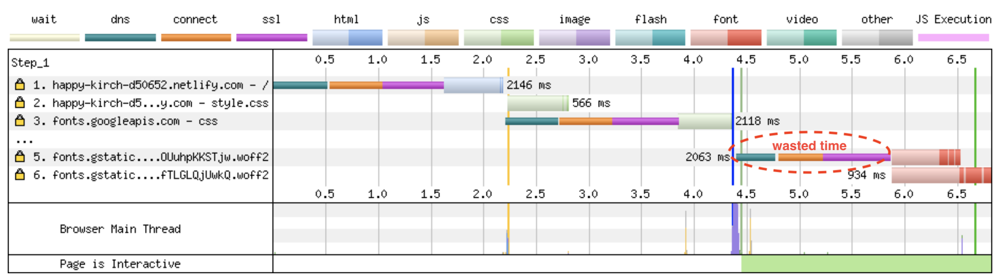
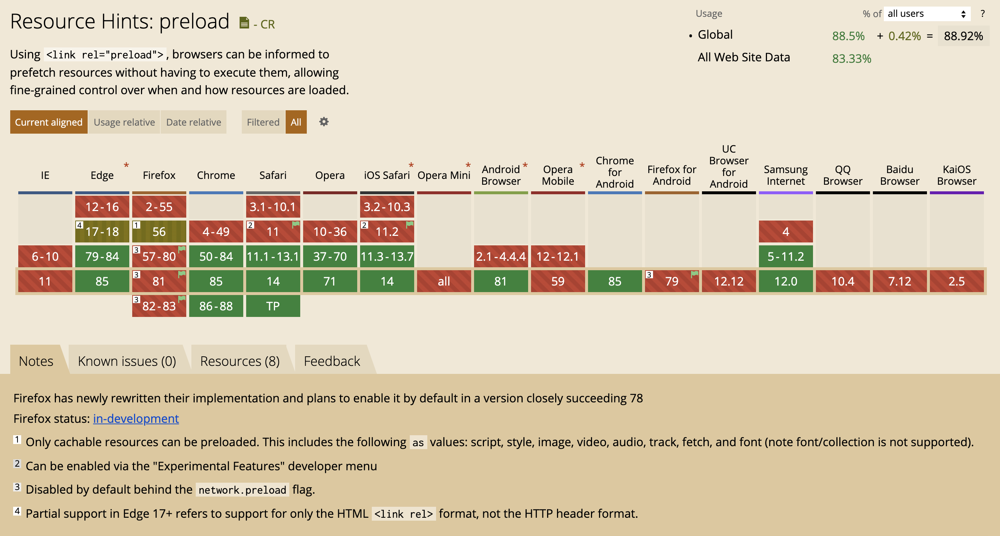
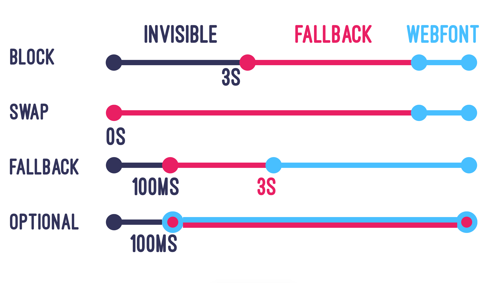

<!-- .slide: data-background="./images/types.jpg" -->
<div class="highlighter">
<h1 class="title dark-background">Hint, Hint, Font Loading Matters!</h1>
<h2 class="subtitle" style="color:#c1ad9a;">Sia Karamalegos</h2>
</div>


---

## hi, i'm sia

⚡ 👩🏻‍💻 🇬🇷 🐶 🐺 🎨 📓 ✈️


---
## [bit.ly/font-perf](http://bit.ly/font-perf)

---

<!-- .slide: data-background="./images/dog-wave.jpg" -->
<h1 class="dark-background">
  <span class="highlighter">Poll</span>
</h1>
Note: Poll - raise hand if (1) Passionate about perf and all the technical details. (2) Think perf is important but still very much learning. (3) Curious but not convinced. (4) Why are the rest of you here??

---

# Why Should I Care?

-v-

> Pinterest reduced load times by 40% and saw a 15% increase in sign ups.

<small>https://wpostats.com/</small>

-v-

> Starbucks implemented a 2x faster time to interactive resulting in a 65% increase in rewards registrations.

<small>[Chrome Dev Summit 2018](https://www.youtube.com/watch?v=Xryhxi45Q5M&t=1113s&index=6&list=PLNYkxOF6rcIDjlCx1PcphPpmf43aKOAdF )</small>

-v-

> AliExpress reduced load by 36% and saw a 10.5% increase in orders.

<small>https://wpostats.com/</small>

-v-

> Speed is now used as a ranking factor for mobile searches.

<small>https://developers.google.com/web/updates/2018/07/search-ads-speed</small>

Note: In 2016, Doubleclick by Google released a report saying that 53% of mobile sites are abandoned if pages take longer than 3 seconds to load.

-v-


<small>[Moving towards a faster web](https://blog.chromium.org/2019/11/moving-towards-faster-web.html)</small>

-v-

The internet consumes 416.2 TWh of electricity per year. A 10% savings would be equivalent to:

- 6.2 million fewer cars on the road 🚗 <!-- .element: class="fragment fade-in-then-semi-out" -->
- 32 billion less pounds of coal being burned 💨 <!-- .element: class="fragment fade-in-then-semi-out" -->
- 486 million tree seedlings grown for 10 years 🌳 <!-- .element: class="fragment fade-in-then-semi-out" -->

<small>[How is your website impacting the planet?](https://www.websitecarbon.com/), [Greenhouse Gas Equivalencies Calculator](https://www.epa.gov/energy/greenhouse-gas-equivalencies-calculator)</small>

Note: Most of the energy is consumed by the network and data center, not users' devices.

---

<!-- .slide: data-background="./images/AA-font.jpg" -->

<div style="background-color:rgba(255,255,255,0.75);padding:20px;">

> Typography is what language looks like.

<small>—Ellen Lupton, Thinking with Type</small>

</div>

---


<small>[When Typography Speaks Louder Than Words](https://www.smashingmagazine.com/2012/04/when-typography-speaks-louder-than-words/)</small>

---


<small>[When Typography Speaks Louder Than Words](https://www.smashingmagazine.com/2012/04/when-typography-speaks-louder-than-words/)</small>

---


---

<!-- .slide: data-background="./images/frustration.jpg" -->
<h1 class="dark-background">
  <span class="highlighter">What annoys you about fonts?</span>
</h1>

---

# Case study: Web Fonts


---

## Web Fonts

<ul class="plus-minus">
  <li class="plus fragment fade-in-then-semi-out">Hosted on fast and reliable CDNs</li>
  <li class="plus fragment fade-in-then-semi-out">Can provide optimized variants based on user's browser</li>
   <li class="plus fragment fade-in-then-semi-out">Opportunity for shared caching on popular fonts</li>
  <li class="plus fragment fade-in-then-semi-out">We now have control over FOUT and FOIT!</li>
  <li class="minus fragment fade-in-then-semi-out">Minumum of 2 separate requests</li>
  <li class="minus fragment fade-in-then-semi-out">Can't use resource hints on the font file</li>
  <li class="minus fragment fade-in-then-semi-out">Doesn't take advantage of HTTP2 multiplexing</li>
</ul>

---


<small>[WebPageTest waterfall](http://webpagetest.org/customWaterfall.php?test=190406_EP_2dc139e2f92f617a2ec5f39624d6c8ca&run=2&width=930)</small>

Note: pause here and ask what else seems wasteful - calling from css and connection time to 2nd domain

---

## Loading Google Fonts from CSS

```css
@import url('https://fonts.googleapis.com/css?family=Open+Sans:400,700');
```


<small>[WebPageTest waterfall](http://webpagetest.org/customWaterfall.php?test=190406_EP_2dc139e2f92f617a2ec5f39624d6c8ca&run=2&width=930)</small>

Note: pause here and ask what else seems wasteful - the connection time to fonts.gstatic.com

---

## Loading Google Fonts from HTML

```html
<link href="https://fonts.googleapis.com/css?family=Muli:400"
      rel="stylesheet">
```


---

## Loading Google Fonts from HTML

```html
<link href="https://fonts.googleapis.com/css?family=Muli:400"
      rel="stylesheet">
```



---


<small>https://twitter.com/addyosmani/status/743571393174872064?lang=en</small>

Note: dns-prefetch only does the dns part of the prefetch, but on the plus side, it doesn't expire after a short amount of time.

---

## Loading Google Fonts with preconnect to fonts.gstatic.com

```html
<link rel="preconnect" href="https://fonts.gstatic.com/" crossorigin>
<link href="https://fonts.googleapis.com/css?family=Muli:400"
      rel="stylesheet">
```


---

<!-- .slide: data-background="./images/greek-types.jpg" -->

<div style="background-color:rgba(255,255,255,0.75);padding:20px;">

# Case Study: <br>Self-Hosted Fonts

</div>

---

```html
<link as="font" type="font/woff2"
  href="./fonts/muli-v12-latin-regular.woff2" crossorigin>

<link as="font" type="font/woff2"
  href="./fonts/muli-v12-latin-700.woff2" crossorigin>
```


<small>[WebPageTest waterfall](http://webpagetest.org/customWaterfall.php?test=190406_S0_0a529e9ce6086cbea8e3aadc942ddbf6&run=2&width=930)</small>

---

```html
<link as="font" type="font/woff2"
  href="./fonts/muli-v12-latin-regular.woff2" crossorigin>

<link as="font" type="font/woff2"
  href="./fonts/muli-v12-latin-700.woff2" crossorigin>
```


---

## Preload self-hosted fonts*

```html
<link rel="preload" as="font" type="font/woff2"
  href="./fonts/muli-v12-latin-regular.woff2" crossorigin>

<link rel="preload" as="font" type="font/woff2"
  href="./fonts/muli-v12-latin-700.woff2" crossorigin>
```


<small>* Note that `preload` loads a resource whether used or not. Only preload resources that are needed on a particular page.</small>

Note: `rel="preload"` tells the browser to declaratively fetch the resource but not “execute” it (our CSS will queue usage). `as="font"` tells the browser what it will be downloading so that it can set an appropriate priority. Without it, the browser would set a default low priority. `type="font/woff2` tells the browser the file type so that it only downloads the resource if it supports that file type. `crossorigin` is required because fonts are fetched using anonymous mode CORS.

---



<small>[caniuse](https://caniuse.com/#feat=link-rel-preload)</small>

---

## [Shared Cache is Going Away](https://www.jefftk.com/p/shared-cache-is-going-away)

<small>[Chrome](https://www.chromestatus.com/feature/5730772021411840), [Firefox](https://bugzilla.mozilla.org/show_bug.cgi?id=1536058), [Safari](https://bugs.webkit.org/show_bug.cgi?id=110269)</small>

---

<!-- .slide: data-background="./images/no.jpg" -->

<div style="background-color:rgba(255,255,255,0.75);padding:20px;">

# UX: Font Rendering

</div>

---

## FOIT


Note: FOIT in action — note the missing navbar text in the filmstrip screenshot (throttled to slow 3G)

---

## `font-display`



<small>https://font-display.glitch.me/</small>

Note: add the `font-display` property to the `@font-face` declaration

---


<small>https://twitter.com/addyosmani/status/1128548064287952896/</small>

---

## FOUT

<video autoplay loop>
  <source src="./images/fout.mp4" type="video/mp4">
  Oops, video not supported
</video>

---

> “The style doesn’t matter so much, it’s that it has to flow the same way.”

— Tim Brown, Twitter

---

## Font Style-Matcher by Monica Dinculescu

[meowni.ca/font-style-matcher/](https://meowni.ca/font-style-matcher/)

---

<!-- .slide: data-background="./images/typography-collage.jpg" -->

<h1 class="dark-background highlighter">Variable Fonts</h1>

---

## More resources mentioned

- [Making Google Fonts Faster⚡](https://sia.codes/posts/making-google-fonts-faster/) - includes how do download and host locally
- [Google Analytics + caniuse = *MAGIC*](https://sia.codes/posts/google-analytics-caniuse-magic/) - how to import your Google Analytics data into caniuse
- [subfont](https://github.com/Munter/subfont)

---

<!-- .slide: data-background="./images/types.jpg" -->

<div style="background-color:rgba(255,255,255,0.75);padding:20px;">

# Thanks!

Slides & resources for this talk at [bit.ly/font-perf](http://bit.ly/font-perf)

Writing, resources, and more at [sia.codes](https://sia.codes/)

</div>