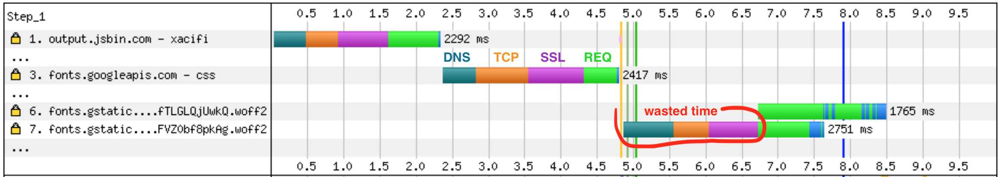

<!-- .slide: data-background="./images/hero_bg.jpg" -->
<h1 class="title dark-background"><span class="translucent">The Future of</span> Front-End Performance</h1>
<h2 class="subtitle">Sia Karamalegos</h2>

---

## hi, i'm sia


---

## Take out a piece of paper...


---

<!-- .slide: data-background="./images/elevator2.jpg" -->
<h1 class="dark-background">
  <span class="highlighter">Why do elevators have mirrors?</span>
</h1>

---

# Why Should I Care?

---

> Pinterest reduced load times by 40% and saw a 15% increase in sign ups.

<small>https://wpostats.com/</small>

---

> Starbucks implemented a 2x faster time to interactive resulting in a 65% increase in rewards registrations.

<small>[Chrome Dev Summit 2018](https://www.youtube.com/watch?v=Xryhxi45Q5M&t=1113s&index=6&list=PLNYkxOF6rcIDjlCx1PcphPpmf43aKOAdF )</small>

---

> Speed is now used as a ranking factor for mobile searches.

<small>https://developers.google.com/web/updates/2018/07/search-ads-speed</small>

Note: In 2016, Doubleclick by Google released a report saying that 53% of mobile sites are abandoned if pages take longer than 3 seconds to load.

---

<h1 style="font-size:2.4em;"> 🧪 Test Environments 🧪 </h1>

---

## Lab/Synthetic Environment Tools

_Emulated CPU and network throttling_

<div id="dev-tool">
  
  <div>Chrome DevTools</div>
</div>
<div id="dev-tool">
  
  <div>Lighthouse</div>
</div>
<div id="dev-tool">
  
  <div>PageSpeed Insights</div>
</div>

Note: DevTools for Network tab (load) and Performance tab (script execution costs)

---

> Your laptop is a filthy liar.

<small>Alex Russell, [Progressive Performance talk at Chrome Dev Summit 2016](https://www.youtube.com/watch?v=4bZvq3nodf4)</small>

Note: network and CPU throttling are not representative of real user experiences. mobile CPUs process in a completely different way, and heat management is especially different.

---

## Optimize for the device and network your users have

- 2-5x difference in fastest vs slowest phones <!-- .element: class="fragment fade-in-then-semi-out" -->
- 75% of worldwide mobile connections on 2G or 3G <!-- .element: class="fragment fade-in-then-semi-out" -->
- Not just developing countries but rural areas or spotty networks like conference wifi <!-- .element: class="fragment fade-in-then-semi-out" -->
- Use Google Analytics data to profile your users and configure webpagetest.org to reflect them more closely <!-- .element: class="fragment fade-in-then-semi-out" -->
- Set performance budgets using webpack <!-- .element: class="fragment fade-in-then-semi-out" -->

<small>https://infrequently.org/2017/10/can-you-afford-it-real-world-web-performance-budgets/</small>

Note: Performance budgets at Google are $200 Android phone on a slow 3G network to target 5s initial load and 2s for subsequent. Converts to 130-170kb gzipped.

---

## Lab/Synthetic Environment Tools

_Real devices and networks_

<div id="dev-tool">
  
  <div>WebPageTest<br>&nbsp;</div>
</div>

<div id="dev-tool">
  
  <div>DevTools +<br>connected device 📱</div>
</div>

Note: Buy a shitty phone and connect it to your computer for on-device debugging. webpagetest.org/easy has a basic set up - $200 phone, slow 3G?

---

## WebPageTest


<small>https://twitter.com/HenriHelvetica/status/1109557588411203584</small>

---

# But I want data from real users

---

## Field/RUM Testing Tools

_Publicly available data_

<div id="dev-tool">
  
  <div>CrUX</div>
</div>

<div id="dev-tool">
  
  <div>PageSpeed Insights</div>
</div>

<div id="dev-tool">
  
  <div>Google BigQuery</div>
</div>

<small>Chrome User Experience (CrUX) data is available in PageSpeed Insights or BigQuery.</small>

---

## Field/RUM Testing Tools

_Self-run data sent to your backend or analytics tool_

- Navigation Timing API
- Resource Timing API
- User Timing API for custom timings

<small>
  https://developers.google.com/web/fundamentals/performance/navigation-and-resource-timing/
  <br />https://www.keycdn.com/blog/user-timing/
<small>

---

# Biggest Bytes

---

Images account for 39-43% of the bytes on average needed to load a webpage.

<small>[httparchive.org](https://httparchive.org), September 2018</small>

---

## Image Optimization Toolbox

- Use the right image type (png vs jpg, gif vs video). <!-- .element: class="fragment fade-in-then-semi-out" -->
- Serve the right size image for the user's screen width and device pixel ratio <!-- .element: class="fragment fade-in-then-semi-out" -->
- Compress images with a tool like ImageOptim, or use a webpack plugin like imagemin-webpack-plugin <!-- .element: class="fragment fade-in-then-semi-out" -->
- Use newer, improved formats like webp. <!-- .element: class="fragment fade-in-then-semi-out" -->
- Lazy loading with a tool like lazysizes <!-- .element: class="fragment fade-in-then-semi-out" -->

<small>
  [Responsive images](https://developer.mozilla.org/en-US/docs/Learn/HTML/Multimedia_and_embedding/Responsive_images) on MDN
  <br /> [Image Performance](https://abookapart.com/products/image-performance) by Mat Marquis
</small>

---

## I can't wait for the future

<small>Native lazy-loading for `` and `<iframe>` hopefully in Chrome ~75</small>

 examples" class="nooutline" width="60%">

<small>[addyosmani.com/blog/lazy-loading/](https://addyosmani.com/blog/lazy-loading/)</small>

---

# Most Expensive Asset

Note: Are all assets created equally?

---

<iframe width="990.6990950226244" height="482" seamless frameborder="0" scrolling="no" src="https://docs.google.com/spreadsheets/d/e/2PACX-1vTlTFx0oq6iA73uPBd4X1kaF05-R82KHMMGF7wzgvPTvdgMsPyjKZk5fAPOmPhc33g_Zoul7EsB2Cg9/pubchart?oid=1765333686&amp;format=image"></iframe>

<small>Adapted from [The Cost of JavaScript](https://medium.com/dev-channel/the-cost-of-javascript-84009f51e99e) by Addy Osmani</small>

---

## TL;DR: Ship less code

- less code = less load + less parse/compile
- holy grail = prioritize only what's needed in view

---

## Client vs Server vs Progressive Rendering

<iframe width="749.4849246231156" height="463.3975" seamless frameborder="0" scrolling="no" src="https://docs.google.com/spreadsheets/d/e/2PACX-1vTlTFx0oq6iA73uPBd4X1kaF05-R82KHMMGF7wzgvPTvdgMsPyjKZk5fAPOmPhc33g_Zoul7EsB2Cg9/pubchart?oid=2121502741&amp;format=interactive"></iframe>

<small>Inspired by https://twitter.com/aerotwist/status/729712502943174657</small>

---

## Client vs Server vs Progressive Rendering

<iframe width="749.4849246231156" height="463.3975" seamless frameborder="0" scrolling="no" src="https://docs.google.com/spreadsheets/d/e/2PACX-1vTlTFx0oq6iA73uPBd4X1kaF05-R82KHMMGF7wzgvPTvdgMsPyjKZk5fAPOmPhc33g_Zoul7EsB2Cg9/pubchart?oid=1546390226&amp;format=interactive"></iframe>

<small>Inspired by https://twitter.com/aerotwist/status/729712502943174657</small>

Note: Paul Lewis coined the term "uncanny valley". Optimizing for content visibility instead of time to interactivity can leave users more frustrated.

---

## Client vs Server vs Progressive Rendering

<iframe width="749.4849246231156" height="463.3975" seamless frameborder="0" scrolling="no" src="https://docs.google.com/spreadsheets/d/e/2PACX-1vTlTFx0oq6iA73uPBd4X1kaF05-R82KHMMGF7wzgvPTvdgMsPyjKZk5fAPOmPhc33g_Zoul7EsB2Cg9/pubchart?oid=1471728610&amp;format=interactive"></iframe>

<small>Inspired by https://twitter.com/aerotwist/status/729712502943174657</small>

Note: PRPL - push minimal code for initial route, render route and get interactive, pre-cache using service workers, and lazy-load async routes. Progressive bootstrapping - Send down a minimally functional page (composed of just the HTML/JS/CSS needed for the current route). As more resources arrive, the app can lazy-load and unlock more features.

---

## Optimizing Time to Interactive

- Analyze your loads and bundles! Don't over-optimize! <!-- .element: class="fragment fade-in-then-semi-out" -->
- Only ship what's immediately needed - use code splitting, pre-caching, and deferred or lazy loading. <!-- .element: class="fragment fade-in-then-semi-out" -->
- Minify to speed up both download and parse/compile. <!-- .element: class="fragment fade-in-then-semi-out" -->
- Compress with gzip or brotli. <!-- .element: class="fragment fade-in-then-semi-out" -->
- Remove unused code with tree shaking or using module imports effectively. <!-- .element: class="fragment fade-in-then-semi-out" -->
- Set up performance budgets to prevent performance creep. <!-- .element: class="fragment fade-in-then-semi-out" -->

<small>https://webpack.js.org/configuration/performance/</small>

---

## Module Imports

```javascript
// Big = 527kb
import _ from 'lodash';

// Big = 527kb
import {isEmpty} from 'lodash';

// Little = 24kb
import isEmpty from 'lodash/isEmpty';

// Big = 544kb
import moment from 'moment';

// Little = 11kb
import addMinutes from 'date-fns/add_minutes';
```

<small>Use Moment? Try [date-fns](https://date-fns.org/) instead.</small>

Note: Tree-shaking can help do this for us so we don't have to worry so much about doing our imports "correctly".

---

## Differential Serving, a.k.a. Serve modern code to modern browsers

```html
<!-- Browsers with ES module support load this file. -->
<script type="module" src="main.mjs"></script>

<!-- Older browsers load this file (and module-supporting -->
<!-- browsers know *not* to load this file). -->
<script nomodule src="main.es5.js"></script>
```

---

## The Cost of Unnecessary Transpiling

<table>
  <thead>
    <tr>
      <th>Version</th>
      <th>Size <br />(minified)</th>
      <th>Size <br />(minified + gzipped)</th>
      <th>Parse/eval time (avg)</th>
    </tr>
  </thead>
  <tbody>
    <tr>
      <td>ES2015+</td>
      <td>80K</td>
      <td><strong>21K</strong></td>
      <td><strong>172ms</strong></td>
    </tr>
    <tr>
      <td>ES5</td>
      <td>175K</td>
      <td><strong>43K</strong></td>
      <td><strong>367ms</strong></td>
    </tr>
  </tbody>
</table>

<small>https://philipwalton.com/articles/deploying-es2015-code-in-production-today/</small>

Note: We transpile and polyfill most code, but most users are on modern browsers. So why are we shippping Unnecessary code? What's the impact?  Webpack can create 2 bundles for you - transpiled to ES5 and not-transpiled ES2015+. These are the results from a small blog app - remember since JS is most expensive asset this affects not just download but parse and compile time. <strong>Bigger apps mean bigger gains</strong>. No time to go through how, but this article goes through the steps. (test using script type=module, set up separate webpack config and need to include modules

---

# ⌚ Latency ⌚

---

## HTTP/1.1 versus HTTP/2


<small>https://deliciousbrains.com/performance-best-practices-http2/</small>

Note: Starts downloading assets as TCP connections become available. In addition, header compression. HTTP2 server push has not lived up to the promise, but it's still a new area. For the most part, need to use https.

---

## Loading Google Fonts from CSS

```css
@import url('https://fonts.googleapis.com/css?family=Open+Sans|Muli');
```


---

## Loading Google Fonts from HTML

```html
<link href="https://fonts.googleapis.com/css?family=Muli:400"
      rel="stylesheet">
```



---


<small>https://twitter.com/addyosmani/status/743571393174872064?lang=en</small>

---

## Google Fonts with preconnect!

```html
<link rel="preconnect" href="https://fonts.gstatic.com/" crossorigin>
<link href="https://fonts.googleapis.com/css?family=Muli:400"
      rel="stylesheet">
```


---

## Self-hosted fonts

```html
<link as="font" type="font/woff2"
  href="./fonts/muli-v12-latin-regular.woff2" crossorigin>

<link as="font" type="font/woff2"
  href="./fonts/muli-v12-latin-700.woff2" crossorigin>
```


Note: This alone does not fix perf problem.

---

## Preloading self-hosted fonts

```html
<link rel="preload" as="font" type="font/woff2"
  href="./fonts/muli-v12-latin-regular.woff2" crossorigin>

<link rel="preload" as="font" type="font/woff2"
  href="./fonts/muli-v12-latin-700.woff2" crossorigin>
```


<small>Note that `preload` loads a resource whether used or not. Only preload resources that are needed on a particular page. Don't self-host popular webfonts like Open Sans or Roboto (sabotages caching).</small>

Note: `rel="preload"` tells the browser to declaratively fetch the resource but not “execute” it (our CSS will queue usage). `as="font"` tells the browser what it will be downloading so that it can set an appropriate priority. Without it, the browser would set a default low priority. `type="font/woff2` tells the browser the file type so that it only downloads the resource if it supports that file type. `crossorigin` is required because fonts are fetched using anonymous mode CORS.

---

## More Latency and Caching Strategies

- Adjust network download priority with **priority hints**
- Use appropriate **caching headers**
- Use **service workers** for precaching and offline optimization - this is hard, try [Workbox](https://developers.google.com/web/tools/workbox/)!
- **Lazy-load** non-critical assets

<small>[Preload, Prefetch And Priorities in Chrome](https://medium.com/reloading/preload-prefetch-and-priorities-in-chrome-776165961bbf) by Addy Osmani<br>https://developers.google.com/web/tools/workbox/</small>

Note: PRPL pattern - push, render, pre-cache, lazy-load

---

<!-- .slide: data-background="./images/baggage_claim.jpg" -->
<h1 class="dark-background">
  <span class="highlighter">Houston's Baggage Claim Complaints</span>
</h1>

<small>http://www.nytimes.com/2012/08/19/opinion/sunday/why-waiting-in-line-is-torture.html</small>

Note: “Often the psychology of queuing is more important than the statistics of the wait itself,” notes the M.I.T. operations researcher Richard Larson. Occupied time (walking to baggage claim) feels shorter than unoccupied time (standing at the carousel).

---

> Are you better off making the site load faster or ensuring that users complete their tasks?

<small>Christine Perfetti, [The Truth About Download Time](https://articles.uie.com/download_time/) 2006</small>

---

<!-- .slide: data-background="./images/hero_bg.jpg" -->
<h1 class="title dark-background">Thanks!</h1>
Slides, resources, and more at <a href="https://bit.ly/siaspeaks" class="dark-background">bit.ly/siaspeaks</a>

