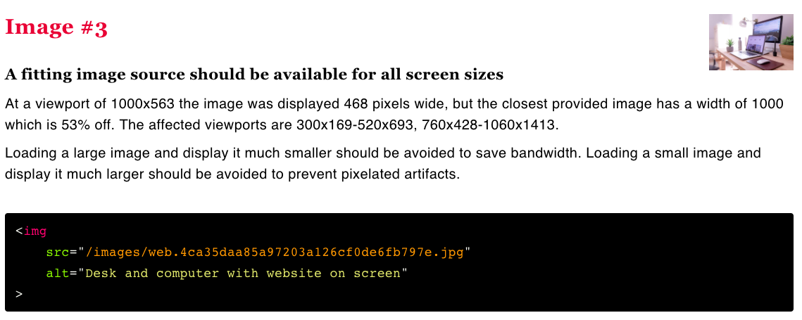
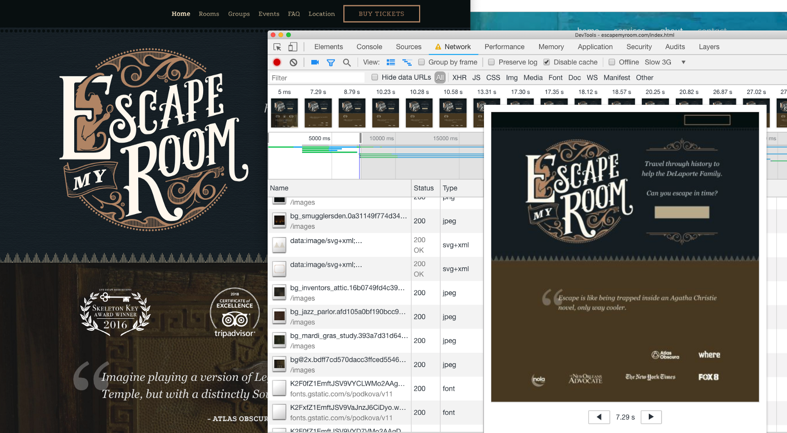

<!-- .slide: data-background="./images/hero_bg.jpg" -->
<h1 class="title dark-background"><span class="translucent">The Future of</span> Front-End Performance</h1>
<h2 class="subtitle">Sia Karamalegos</h2>

---

## hi, i'm sia

⚡ 👩🏻‍💻 🇬🇷 🐶 🐺 🎨 📓 ✈️


---

## [bit.ly/perf-90](http://bit.ly/perf-90)

---

## Take out a piece of paper...


---

<!-- .slide: data-background="./images/elevator2.jpg" -->
<h1 class="dark-background">
  <span class="highlighter">Why do elevators have mirrors?</span>
</h1>

---

# Why Should I Care?

---

> Pinterest reduced load times by 40% and saw a 15% increase in sign ups.

<small>https://wpostats.com/</small>

---

> Starbucks implemented a 2x faster time to interactive resulting in a 65% increase in rewards registrations.

<small>[Chrome Dev Summit 2018](https://www.youtube.com/watch?v=Xryhxi45Q5M&t=1113s&index=6&list=PLNYkxOF6rcIDjlCx1PcphPpmf43aKOAdF )</small>

---

> AliExpress reduced load by 36% and saw a 10.5% increase in orders.

<small>https://wpostats.com/</small>

---

> Speed is now used as a ranking factor for mobile searches.

<small>https://developers.google.com/web/updates/2018/07/search-ads-speed</small>

Note: In 2016, Doubleclick by Google released a report saying that 53% of mobile sites are abandoned if pages take longer than 3 seconds to load.

---


<small>[Moving towards a faster web](https://blog.chromium.org/2019/11/moving-towards-faster-web.html)</small>

---

The internet consumes 416.2 TWh of electricity per year. A 10% savings would be equivalent to:

- 6.2 million fewer cars on the road 🚗 <!-- .element: class="fragment fade-in-then-semi-out" -->
- 32 billion less pounds of coal being burned 💨 <!-- .element: class="fragment fade-in-then-semi-out" -->
- 486 million tree seedlings grown for 10 years 🌳 <!-- .element: class="fragment fade-in-then-semi-out" -->

<small>[How is your website impacting the planet?](https://www.websitecarbon.com/), [Greenhouse Gas Equivalencies Calculator](https://www.epa.gov/energy/greenhouse-gas-equivalencies-calculator)</small>

Note: Most of the energy is consumed by the network and data center, not users' devices.

---

<h1 style="font-size:2.4em;"> 🧪 Test Environments 🧪 </h1>

---

## Testing Environments

<br>

<table class="fixed-two-column" id="invisible-gridlines">
  <thead>
    <tr>
      <th>Lab/Synthetic</th>
      <th>Field/Real User Monitoring (RUM)</th>
    </tr>
  </thead>
  <tbody>
    <tr>
      <td>
        <ul class="plus-minus" style="display:inline;">
          <li class="plus">Controlled environment</li>
          <li class="plus">Predefined network and device settings</li>
          <li class="plus">Reproducible for better performance debugging</li>
          <li class="minus">May not capture real-world bottlenecks</li>
        </ul>
      </td>
      <td>
        <ul class="plus-minus" style="display:inline;">
          <li class="plus">Performance data from **real user page loads** and interactions</li>
          <li class="minus">Limited data and performance debugging capability</li>
      </td>
    </tr>
  </tbody>
</table>

---

## Lab/Synthetic Environment Tools

_Emulated CPU and network throttling_

<div id="dev-tool">
  
  <div>Chrome DevTools</div>
</div>
<div id="dev-tool">
  
  <div>Lighthouse</div>
</div>
<div id="dev-tool">
  
  <div>PageSpeed Insights</div>
</div>

Note: DevTools for Network tab (load) and Performance tab (script execution costs)

---

> Your laptop is a filthy liar.

<small>Alex Russell, [Progressive Performance talk at Chrome Dev Summit 2016](https://www.youtube.com/watch?v=4bZvq3nodf4)</small>

Note: network and CPU throttling are not representative of real user experiences. mobile CPUs process in a completely different way, and heat management is especially different.

---

## Optimize for the device and network your users have

- 2-5x difference in fastest vs slowest phones <!-- .element: class="fragment fade-in-then-semi-out" -->
- 75% of worldwide mobile connections on 2G or 3G <!-- .element: class="fragment fade-in-then-semi-out" -->
- Not just developing countries but rural areas or spotty networks like conference wifi <!-- .element: class="fragment fade-in-then-semi-out" -->
- Use Google Analytics data to profile your users and configure webpagetest.org to reflect them more closely <!-- .element: class="fragment fade-in-then-semi-out" -->
- Set performance budgets using webpack <!-- .element: class="fragment fade-in-then-semi-out" -->

<small>https://infrequently.org/2017/10/can-you-afford-it-real-world-web-performance-budgets/</small>

Note: Performance budgets at Google are $200 Android phone on a slow 3G network to target 5s initial load and 2s for subsequent. Converts to 130-170kb gzipped.

---

## Lab/Synthetic Environment Tools

_Real devices and networks_

<div id="dev-tool">
  
  <div>WebPageTest<br>&nbsp;</div>
</div>

<div id="dev-tool">
  
  <div>DevTools +<br>connected device 📱</div>
</div>

Note: Buy a shitty phone and connect it to your computer for on-device debugging. webpagetest.org/easy has a basic set up - $200 phone, slow 3G?

---

## WebPageTest


<small>https://twitter.com/HenriHelvetica/status/1109557588411203584</small>

---

# But I want data from real users

---

## Field/RUM Testing Tools

_Publicly available data_

<div id="dev-tool">
  
  <div>CrUX</div>
</div>

<div id="dev-tool">
  
  <div>PageSpeed Insights</div>
</div>

<div id="dev-tool">
  
  <div>Google BigQuery</div>
</div>

<small>Chrome User Experience (CrUX) data is available in PageSpeed Insights or BigQuery.</small>

---

## Field/RUM Testing Tools

_Self-run data sent to your backend or analytics tool_

- Navigation Timing API
- Resource Timing API
- User Timing API for custom timings

<small>
  https://developers.google.com/web/fundamentals/performance/navigation-and-resource-timing/
  <br />https://www.keycdn.com/blog/user-timing/
<small>

---

# More tools in the toolbox

---

## Test My Site


- Snazzy-looking and gives pretty pdf
- High-level data from WebPageTest and PageSpeed Insights
- Good for the speed scorecard and impact calculator

---

## RespImageLint

[RespImageLint](https://github.com/ausi/respimagelint) is a bookmarklet linter for responsive images.



Note: Lighthouse audits also does this better now, but I still like this quick tool and the prescriptive suggestions.

---

## Bundle Analyzers

- Several webpack tools exist - check out options on [SurviveJS](https://survivejs.com/webpack/optimizing/build-analysis/)
- One of my favorites: `webpack-bundle-analyzer`


---

## MOAR Tools

- Dev Tools Coverage analyzer
- [Performance Budget Calculator](https://perf-budget-calculator.firebaseapp.com/)
- [Bundlephobia](https://bundlephobia.com/)
- [Cloudinary Website Speed Test Image Analysis Tool](https://webspeedtest.cloudinary.com/)

---

# 📈 Metrics 📈

---

> When optimizing for speed, <br>**user experience** should always <br>be your primary metric.

---

## User experience

1. When can I see the page? <!-- .element: class="fragment fade-in-then-semi-out" -->
2. When can I interact with it? <!-- .element: class="fragment fade-in-then-semi-out" -->
3. Is it smooth? <!-- .element: class="fragment fade-in-then-semi-out" -->

---

## When can I see the page?

- Speed index measures how quickly the page contents are visually populated, but it's not simple<!-- .element: class="fragment fade-in-then-semi-out" -->
- Largest contentful paint measures when the largest image or text paint in the viewport occurs<!-- .element: class="fragment fade-in" -->
  - Elements removed from the DOM are invalidated (splash screens)<!-- .element: class="fragment fade-in" -->
  - Will have a larger weight in Lighthouse<!-- .element: class="fragment fade-in" -->

<small>[Largest Contentful Paint (LCP)](https://web.dev/lcp/), [Speed Index](https://sites.google.com/a/webpagetest.org/docs/using-webpagetest/metrics/speed-index)</small>

---

## When can I interact with the page?

<iframe width="560" height="315" src="https://www.youtube.com/embed/Lx1cYJAVnzA" frameborder="0" allow="autoplay; encrypted-media" allowfullscreen></iframe>

<small>End to End Apps with Polymer by Kevin Schaaf, Polymer Summit 2017</small>

---

## When can I interact with the page?

- Time to Interactive (TTI) measures how long it takes a page to become fully interactive<!-- .element: class="fragment fade-in-then-semi-out" -->
- Total blocking time (TBT) measures the time between First Contentful Paint (FCP) and TTI where the main thread was blocked for long enough to prevent input responsiveness.<!-- .element: class="fragment fade-in-then-semi-out" -->
- TBT will have a larger weight in Lighthouse.<!-- .element: class="fragment fade-in-then-semi-out" -->
- Large blocks of scripting on the main thread makes both worse.<!-- .element: class="fragment fade-in-then-semi-out" -->

<small>[How does TBT relate to TTI?](https://web.dev/tbt/#how-does-tbt-relate-to-tti)</small>

Note: the point at which layout has stabilized, key webfonts are visible, and the main thread is available enough to handle user input within 50ms. The main thread is considered "blocked" any time there's a Long Task—a task that runs on the main thread for more than 50 milliseconds (ms).

---

## Is it smooth? Frame Rate...


Note: Frame rate or frames per second (fps), is one measure of responsiveness. Modern devices refresh their screens at a rate of 60 fps. Converting that to an individual frame, we theoretically have 16 ms to render. In actuality, the browser needs some of that time, so we should target 10ms per frame. Any more, and the human eye will be able to detect the jank or jitter.

---

## RAIL model for performance goals

- **Response**: process events in under 50ms
- **Animation**: produce a frame in 10ms (for 60fps devices)
- **Idle**: maximize idle time (to respond in 50ms or less)
- **Load**: deliver content and become interactive in under 5 seconds, 2 seconds for subsequent loads*

<small>[Measure Performance with the RAIL Model](https://developers.google.com/web/fundamentals/performance/rail)</small>

Note: R:Complete a transition initiated by user input within 100ms. A: Have 16ms, but browsers need about 6ms to render each frame. I: Maximize idle time to increase the odds that the page responds to user input within 50ms. L:on mid-range mobile devices with slow 3G connections

---


## DevTools High-Level Orientation

- **Performance**: script and other execution costs (flame chart)
- **Network**: download time (waterfall)
- **Audits**: scores performance, PWAs, accessibility, etc (Lighthouse)
- **Coverage**: shows used vs. unused bytes includes in the load

Note: Lots of other cool tools exist like local overrides, paint layers, etc.

---


Note: You can use incognito mode, but if you want to be able to test caching, you should set up a separate Chrome profile...

---

# Set up DevTools #LikeABoss


[bit.ly/boss-devtools](http://bit.ly/boss-devtools)

---

# ⌚ Latency ⌚

Note: Who is brave enough to admit they don't really know what that means?

---

<section>
  <h2>latency</h2>
  <p>/ˈlātənsē/</p>
  <ol>
	  <li class="fragment fade-in-then-semi-out">the state of existing but not yet being developed or manifest; concealment.
      <br /><small><em>"tension, and the latency of violence, make the greatest impressions"</em></small></li>
	  <li class="fragment fade-in-then-semi-out">the delay before a transfer of data begins following an instruction for its transfer.
      <br /><small><em>"poor performance due to network latency"</em></small></li>
  </ul>
</section>

Note: http://www.grandrapidsohio.com/, https://www.clioandcalliope.com/

---

## HTTP/1.1


<small>https://deliciousbrains.com/performance-best-practices-http2/</small>

Note: Starts downloading assets as TCP connections become available

---

## HTTP/2


<small>https://deliciousbrains.com/performance-best-practices-http2/</small>

Note: In addition, header compression. HTTP2 server push has not lived up to the promise, but it's still a new area. For the most part, need to use https.

---

[ishttp2fastyet.com/](http://ishttp2fastyet.com/)

---


<small>https://twitter.com/jaffathecake/status/1044121129848377344</small>

---

# Fonts


---

## Webfonts

<ul class="plus-minus">
  <li class="plus">Hosted on fast and reliable CDNs</li>
  <li class="plus">Can provide optimized variants based on user's browser</li>
   <li class="plus">Opportunity for shared caching on popular fonts</li>
  <li class="plus">We now have control over FOUT and FOIT!</li>
  <li class="minus">Minumum of 2 separate requests</li>
  <li class="minus">Can't use resource hints on the font file</li>
  <li class="minus">Doesn't take advantage of HTTP2 multiplexing</li>
</ul>

---


<small>[WebPageTest waterfall](http://webpagetest.org/customWaterfall.php?test=190406_EP_2dc139e2f92f617a2ec5f39624d6c8ca&run=2&width=930)</small>

Note: pause here and ask what else seems wasteful - calling from css and connection time to 2nd domain

---

## Loading Google Fonts from CSS

```css
@import url('https://fonts.googleapis.com/css?family=Open+Sans:400,700');
```


<small>[WebPageTest waterfall](http://webpagetest.org/customWaterfall.php?test=190406_EP_2dc139e2f92f617a2ec5f39624d6c8ca&run=2&width=930)</small>

Note: pause here and ask what else seems wasteful - the connection time to fonts.gstatic.com

---

## Loading Google Fonts from HTML

```html
<link href="https://fonts.googleapis.com/css?family=Muli:400"
      rel="stylesheet">
```


---

## Loading Google Fonts from HTML

```html
<link href="https://fonts.googleapis.com/css?family=Muli:400"
      rel="stylesheet">
```


---


<small>https://twitter.com/addyosmani/status/743571393174872064?lang=en</small>

Note: dns-prefetch only does the dns part of the prefetch, but on the plus side, it doesn't expire after a short amount of time.

---

## Loading Google Fonts with preconnect to fonts.gstatic.com

```html
<link rel="preconnect" href="https://fonts.gstatic.com/" crossorigin>
<link href="https://fonts.googleapis.com/css?family=Muli:400"
      rel="stylesheet">
```


---

## Self-Hosted Fonts

```html
<link as="font" type="font/woff2"
  href="./fonts/muli-v12-latin-regular.woff2" crossorigin>

<link as="font" type="font/woff2"
  href="./fonts/muli-v12-latin-700.woff2" crossorigin>
```


<small>[WebPageTest waterfall](http://webpagetest.org/customWaterfall.php?test=190406_S0_0a529e9ce6086cbea8e3aadc942ddbf6&run=2&width=930)</small>

---

## Self-Hosted Fonts

```html
<link as="font" type="font/woff2"
  href="./fonts/muli-v12-latin-regular.woff2" crossorigin>

<link as="font" type="font/woff2"
  href="./fonts/muli-v12-latin-700.woff2" crossorigin>
```


---

## Preloading self-hosted fonts

```html
<link rel="preload" as="font" type="font/woff2"
  href="./fonts/muli-v12-latin-regular.woff2" crossorigin>

<link rel="preload" as="font" type="font/woff2"
  href="./fonts/muli-v12-latin-700.woff2" crossorigin>
```


<small>Note that `preload` loads a resource whether used or not. Only preload resources that are needed on a particular page. ~~Don't self-host popular webfonts like Open Sans or Roboto (sabotages caching)~~.</small>

Note: `rel="preload"` tells the browser to declaratively fetch the resource but not “execute” it (our CSS will queue usage). `as="font"` tells the browser what it will be downloading so that it can set an appropriate priority. Without it, the browser would set a default low priority. `type="font/woff2` tells the browser the file type so that it only downloads the resource if it supports that file type. `crossorigin` is required because fonts are fetched using anonymous mode CORS.

---

[Shared Cache is Going Away](https://www.jefftk.com/p/shared-cache-is-going-away)

<small>[Chrome](https://www.chromestatus.com/feature/5730772021411840), [Firefox](https://bugzilla.mozilla.org/show_bug.cgi?id=1536058), [Safari](https://bugs.webkit.org/show_bug.cgi?id=110269)</small>

---

## FOIT



Note: FOIT in action — note the missing navbar text in the filmstrip screenshot (throttled to slow 3G)

---

## `font-display`


<small>https://font-display.glitch.me/</small>

Note: add the `font-display` property to the `@font-face` declaration

---


<small>https://twitter.com/addyosmani/status/1128548064287952896/</small>

---

## More Latency and Caching Strategies

- Adjust network download priority with **priority hints**
- Use appropriate **caching headers**
- Use **service workers** for precaching and offline optimization
- **Lazy-load** non-critical assets (below-the-fold assets like images, components in JavaScript, etc.)
- Use SVGs instead of icon fonts or subset the font.
- Inline critical CSS with [Critical](https://github.com/addyosmani/critical) and asynchronously load non-critical CSS with [loadCSS](https://github.com/filamentgroup/loadCSS).

<small>[Preload, Prefetch And Priorities in Chrome](https://medium.com/reloading/preload-prefetch-and-priorities-in-chrome-776165961bbf) by Addy Osmani</small>

Note: PRPL pattern - push, render, pre-cache, lazy-load

---

## More resources mentioned

- [Making Google Fonts Faster⚡](https://sia.codes/posts/making-google-fonts-faster/) - includes how do download and host locally
- [Google Analytics + caniuse = *MAGIC*](https://sia.codes/posts/google-analytics-caniuse-magic/) - how to import your Google Analytics data into caniuse
- [subfont](https://github.com/Munter/subfont)

---

# Optimized, Responsive <br>📸 Images 📸

---

Images account for 50% of the bytes <br>on average needed to load a webpage.

<small>[httparchive.org](https://httparchive.org), November 2019</small>

---

## Image Goals

1. Users shouldn't download unnecessary bytes.
2. Our images should look good.

---

## Responsive &amp; Optimized Toolbox

- Best file format <!-- .element: class="fragment fade-in-then-semi-out" -->
- Right size and resolution <!-- .element: class="fragment fade-in-then-semi-out" -->
- Art direction <!-- .element: class="fragment fade-in-then-semi-out" -->
- Lazy loading <!-- .element: class="fragment fade-in-then-semi-out" -->

---

# 💾  File Format  💾

---

> Choosing the right image format... can be far more important than any flashy new “responsive image” technique.

<small>Mat Marquis, [Image Performance](https://abookapart.com/products/image-performance)</small>

Note: Responsive Issues Community Group (RICG) chair. Getting the right image format is more important than any responsive image technique.

---

## Raster vs Vector


<small>https://commons.wikimedia.org/wiki/File:Bitmap_VS_SVG.svg</small>

Note: Raster images contain a set of data about a 2D grid of pixels. Vectors are a system of coordinates and "vectors" than can be redrawn at any size. Rasters are good for photo-realism. Raster file formats are really just different compression methods.

---

## File Format Options

- SVG (vector) - best for limited colors and sharp lines (e.g., logos) <!-- .element: class="fragment fade-in-then-semi-out" -->
- GIF (lossy) - fun but terrible. Use SVG or video instead <!-- .element: class="fragment fade-in-then-semi-out" -->
- PNG (lossless) - best for photo-realistic with transparency <!-- .element: class="fragment fade-in-then-semi-out" -->
- JPG (lossy) - much better compression based on hue <!-- .element: class="fragment fade-in-then-semi-out" -->
- WEBP (lossy or lossless) - best of both PNG and JPG with smaller file sizes <!-- .element: class="fragment fade-in-then-semi-out" -->

<small>[Responsive Doggos Demo](https://sia.codes/responsive-images-demo/)</small>

Note: Raster file formats are really just different compression methods. **SVG**: Can style and animate with CSS or make basic edits in XML. **GIF**: huge file sizes for animation, use video instead. svg or jpg are better for stills. Twitter converts GIF to video. **Lossless compression** - like using ZIP for a file but all the data is still saved. **PNG**: Use jpg if don't need transparency. **JPG**: much better compression algos.

---

# 📺 Size &amp; Resolution 📺

---

## Demystifying Resolution

**DPR** = device pixel ratio

**In layman's terms**:<br> On a 2x screen, a displayed image width of 100px needs a 200px file/natural width image to look good.

---

## `srcset`

- Communicates a set of images and the natural size of each image
- Always include a **base src** attribute for older browsers
- Browser assumes a display width of `100vw`

**`srcset` files are candidates, not commands.**

```html

```

Note: `srcset` is an attribute for ``. Width is in pixels even though is says `w`. Format is filename, space, actual image width in pixels. Alternatively, use x-descriptors.

---

## `sizes`

- Communicates display width for a set of media conditions
- **Order matters! First match is used.**
- Leave out the media condition for the last one (default for no match)
- Add analogous CSS

```html

```

Note: Format is [media condition][space][display width]. Once again, these are candidates, not commands. We are letting the browser choose which file to use ultimately.

---

# 🎨 Art Direction 🎨


Note: (1) Art direction is a technique for drawing attention to the most important parts, or targeting specific features of an image, even when it’s viewed on different devices or platforms. (2) So how do we do art direction?

---

## `<picture>`

- Provide multiple images based on device size, resolution, orientation, and more.
- Use `media` attribute for viewport spec. First match is used.
- Always provide `` last for no match or browsers that do not support `<picture>` and `<source>`

```html
<picture>
  <source media="(min-width: 800px)"
          srcset="wide_800.jpg 800w,
                  wide_1600.jpg 1600w">
  <source media="(min-width: 400px)"
          srcset="narrow_400.jpg 400w,
                  narrow_800.jpg 800w">
  
</picture>
```

Note: (1) In this `picture` tag, we have 2 sources and an img. Older browsers simply ignore the picture and source tags and use the img tag. (2) The video tag also works this way and can have multiple `source` tags

---

## Bleeding-Edge File Formats

- Use `<picture>` for new file formats like `webp`!
- The browser uses the first compatible file type listed.
- The `` source should be a fallback file format for browsers that don't support the previous formats listed.

```html
<picture>
  <source type="image/webp" srcset="pug_life.webp">
  
</picture>
```

---

## `webp`, `srcset`, &amp; `sizes`, oh my!

```html
<picture>
  <source srcset="./images/sofa_pug_400.webp 400w,
                  ./images/sofa_pug_800.webp 800w"
          type="image/webp" />
  
</picture>
```

---

## Do I really have to write all this markup?

Nope. Some (not all) tooling options:

- Simple `` and server selects best image to serve
- Paid cloud-based services like [Cloudinary](https://cloudinary.com)
- Build tools like various webpack loaders

<small>[Image Analysis Tool by Cloudinary](https://webspeedtest.cloudinary.com/)</small>

Note: (1) Many people have their server hijack the request and serve the best image to minimize markup. Could also use a serverless function. (2) Cost money. (3) So many options - both create your srcset code and process the images

---

## CSS Background Image Performance

- Use media queries to select the best width image for a chosen screen size and DPR
- Use postcss/autoprefixer to get prefixes

  ```css
  @media only screen and (min-width: 320px) {
    /* small screen, DPR = 1 */ }
  @media only screen and (min-device-pixel-ratio: 2) and (min-width: 320px),
    only screen and (min-resolution: 192dpi) and (min-width: 320px),
    only screen and (min-resolution: 2dppx) and (min-width: 320px),{
    /* small screen, DPR = 2 */ }
  ```

---

# `display: none;`
# not a perf strategy.

Note: Some browsers will still load hidden images.

---

## ⚡🦄🌈⚡ Native lazy-loading ⚡🦄🌈⚡

```html
<!-- Lazy-load offscreen image when user scrolls near -->


<!-- Load an image immediately -->

```

<small>[addyosmani.com/blog/lazy-loading/](https://addyosmani.com/blog/lazy-loading/)</small>

---

# ⚡🦄🐈🌈🐼🍕🎂🍾🎉🐶🦄🐈🌈🐼🍕🎂🍾🎉🐶⚡🐈🌈🐼🍕🎂🍾🎉🐶⚡🦄🌈🐼🍕🎂🍾🎉🐶⚡🦄🐈

---

# 😭😭😭😭😭😭


---

In the meantime, use a tool like [lazysizes](https://github.com/aFarkas/lazysizes).

---

## Image Optimization Toolbox

- Use the right image type (png vs jpg, gif vs video). <!-- .element: class="fragment fade-in-then-semi-out" -->
- Serve the right size image for the user's screen width and device pixel ratio <!-- .element: class="fragment fade-in-then-semi-out" -->
- Compress images with a tool like ImageOptim, or use a webpack plugin like imagemin-webpack-plugin <!-- .element: class="fragment fade-in-then-semi-out" -->
- Use newer, improved formats like webp. <!-- .element: class="fragment fade-in-then-semi-out" -->
- Lazy loading with a tool like lazysizes <!-- .element: class="fragment fade-in-then-semi-out" -->

<br>
<br>
<small>
  Check out <a href="https://developer.mozilla.org/en-US/docs/Learn/HTML/Multimedia_and_embedding/Responsive_images">Responsive images</a> on MDN &amp; <a href="https://abookapart.com/products/image-performance">Image Performance</a> by Mat Marquis.
  <br><a href="https://www.npmjs.com/package/sharp">Sharp</a> &amp; <a href="https://www.imagemagick.org/script/index.php">Imagemagick</a> are great for resizing images. Examples at <a href="https://web.dev/fast/serve-responsive-images">Serve Responsive Images</a>. Use cwebp for creating webp files (<a href="https://developers.google.com/speed/webp/docs/cwebp">docs</a>).
</small>

---


<small>https://twitter.com/TheGreenGreek/status/1201494377522225153, https://github.com/siakaramalegos/images-on-the-command-line</small>

---

# Download cost:<br>💰 JavaScript 💰

Note: Are all assets created equally?

---

<iframe width="990.6990950226244" height="482" seamless frameborder="0" scrolling="no" src="https://docs.google.com/spreadsheets/d/e/2PACX-1vTlTFx0oq6iA73uPBd4X1kaF05-R82KHMMGF7wzgvPTvdgMsPyjKZk5fAPOmPhc33g_Zoul7EsB2Cg9/pubchart?oid=1765333686&amp;format=image"></iframe>

<small>Adapted from [The Cost of JavaScript](https://medium.com/dev-channel/the-cost-of-javascript-84009f51e99e) by Addy Osmani</small>

---

## TL;DR: Ship less code

- less code = less load + less parse/compile
- holy grail = prioritize only what's needed in view

---

<!-- .slide: data-background="./images/newspaper.jpg" -->

<h1 class="dark-background">
  <span class="highlighter">Case Study</span>
</h1>

Note: Run a Network profile w/o throttling on one of the following: cnn.com, bbc.com, nytimes.com. Run a Performance profile and check out Summary pane for JS execution time. Click on the Bottom-up pane and group by feature, especially domain and product. Which 3rd-party scripts are the worst offenders? Go back to the Network tab, right-click on one or more of your worst offenders, and select "Block request domain" - edit to use *.domain. Go back to the Performance tab and re-run the profile on reload. Use the timeline sessions list to switch back and forth and compare the results. How can we use this info to improve performance? Photo by Hayden Walker on Unsplash https://unsplash.com/photos/ihiEd-_4TNY

---

## Module Imports

```javascript
// Big = 527kb
import _ from 'lodash';

// Big = 527kb
import {isEmpty} from 'lodash';

// Little = 24kb
import isEmpty from 'lodash/isEmpty';

// Big = 544kb
import moment from 'moment';

// Little = 11kb
import addMinutes from 'date-fns/add_minutes';
```

<small>Use Moment? Try [date-fns](https://date-fns.org/) instead.</small>

Note: Tree-shaking can help do this for us so we don't have to worry so much about doing our imports "correctly".

---

## Client vs Server vs Progressive Rendering

<iframe width="749.4849246231156" height="463.3975" seamless frameborder="0" scrolling="no" src="https://docs.google.com/spreadsheets/d/e/2PACX-1vTlTFx0oq6iA73uPBd4X1kaF05-R82KHMMGF7wzgvPTvdgMsPyjKZk5fAPOmPhc33g_Zoul7EsB2Cg9/pubchart?oid=2121502741&amp;format=interactive"></iframe>

<small>Inspired by https://twitter.com/aerotwist/status/729712502943174657</small>

---

## Client vs Server vs Progressive Rendering

<iframe width="749.4849246231156" height="463.3975" seamless frameborder="0" scrolling="no" src="https://docs.google.com/spreadsheets/d/e/2PACX-1vTlTFx0oq6iA73uPBd4X1kaF05-R82KHMMGF7wzgvPTvdgMsPyjKZk5fAPOmPhc33g_Zoul7EsB2Cg9/pubchart?oid=1546390226&amp;format=interactive"></iframe>

<small>Inspired by https://twitter.com/aerotwist/status/729712502943174657</small>

Note: Paul Lewis coined the term "uncanny valley". Optimizing for content visibility instead of time to interactivity can leave users more frustrated.

---

## Client vs Server vs Progressive Rendering

<iframe width="749.4849246231156" height="463.3975" seamless frameborder="0" scrolling="no" src="https://docs.google.com/spreadsheets/d/e/2PACX-1vTlTFx0oq6iA73uPBd4X1kaF05-R82KHMMGF7wzgvPTvdgMsPyjKZk5fAPOmPhc33g_Zoul7EsB2Cg9/pubchart?oid=1471728610&amp;format=interactive"></iframe>

<small>Inspired by https://twitter.com/aerotwist/status/729712502943174657</small>

Note: PRPL - push minimal code for initial route, render route and get interactive, pre-cache using service workers, and lazy-load async routes. Progressive bootstrapping - Send down a minimally functional page (composed of just the HTML/JS/CSS needed for the current route). As more resources arrive, the app can lazy-load and unlock more features.

---

## Code Splitting Strategies

1. By **entry point** manually with `entry` config (better combined with #2 to prevent dupes)
2. Prevent duplication and **split chunks** with [SplitChunksPlugin](https://webpack.js.org/plugins/split-chunks-plugin/)
3. **Dynamic imports** via inline functions that are only imported when needed

<small>[webpack guide on code splitting](https://webpack.js.org/guides/code-splitting)</small>

---

## Prefetch chunks while idle

```javascript
import('marked' /* webpackChunkName: "marked", webpackPrefetch: true */)
```

<small>Read more: [`<link rel="prefetch/preload">` in webpack](https://medium.com/webpack/link-rel-prefetch-preload-in-webpack-51a52358f84c) by Tobias Koppers</small>

Note: caveats about the prefetch queue even if suddenly needed now also definitely downloads so don't do too much of this

---

## Optimizing Time to Interactive

- Analyze your loads and bundles! Don't over-optimize! <!-- .element: class="fragment fade-in-then-semi-out" -->
- Only ship what's immediately needed - use code splitting, pre-caching, and deferred or lazy loading. <!-- .element: class="fragment fade-in-then-semi-out" -->
- Minify to speed up both download and parse/compile. <!-- .element: class="fragment fade-in-then-semi-out" -->
- Compress with gzip or brotli. <!-- .element: class="fragment fade-in-then-semi-out" -->
- Remove unused code with tree shaking or using module imports effectively. <!-- .element: class="fragment fade-in-then-semi-out" -->
- Set up performance budgets to prevent performance creep. <!-- .element: class="fragment fade-in-then-semi-out" -->

<small>https://webpack.js.org/configuration/performance/</small>

---

<!-- .slide: data-background="./images/vintage-suitcases.jpg" -->

<h1 class="dark-background">
  <span class="highlighter">Vintage Bundles</span>
</h1>

Note: Photo by Erwan Hesry on Unsplash https://unsplash.com/photos/Q34YB7yjAxA

---

## Differential Serving, a.k.a. Serve modern code to modern browsers

```html
<!-- Browsers with ES module support load this file. -->
<script type="module" src="main.mjs"></script>

<!-- Older browsers load this file (and module-supporting -->
<!-- browsers know *not* to load this file). -->
<script nomodule src="main.es5.js"></script>
```

---

## The Cost of Unnecessary Transpiling

<table>
  <thead>
    <tr>
      <th>Version</th>
      <th>Size <br />(minified)</th>
      <th>Size <br />(minified + gzipped)</th>
      <th>Parse/eval time (avg)</th>
    </tr>
  </thead>
  <tbody>
    <tr>
      <td>ES2015+</td>
      <td>80K</td>
      <td><strong>21K</strong></td>
      <td><strong>172ms</strong></td>
    </tr>
    <tr>
      <td>ES5</td>
      <td>175K</td>
      <td><strong>43K</strong></td>
      <td><strong>367ms</strong></td>
    </tr>
  </tbody>
</table>

<small>https://philipwalton.com/articles/deploying-es2015-code-in-production-today/</small>

Note: We transpile and polyfill most code, but most users are on modern browsers. So why are we shippping Unnecessary code? What's the impact?  Webpack can create 2 bundles for you - transpiled to ES5 and not-transpiled ES2015+. These are the results from a small blog app - remember since JS is most expensive asset this affects not just download but parse and compile time. <strong>Bigger apps mean bigger gains</strong>. No time to go through how, but this article goes through the steps. (test using script type=module, set up separate webpack config and need to include modules

---

## Differential Serving Resources

- [Deploying ES2015+ Code in Production Today](https://philipwalton.com/articles/deploying-es2015-code-in-production-today/) by Philip Walton
- [Doing Differential Serving in 2019](https://calendar.perfplanet.com/2018/doing-differential-serving-in-2019/) by Jeremy Wagner and [repo](https://github.com/malchata/diff-serving)
- [Serve modern code to modern browsers for faster page loads](https://web.dev/fast/serve-modern-code-to-modern-browsers) by Houssein Djirdeh (and click through for codelab)

---

<!-- .slide: data-background="./images/baggage_claim.jpg" -->
<h1 class="dark-background">
  <span class="highlighter">Houston's Baggage Claim Complaints</span>
</h1>

<small>http://www.nytimes.com/2012/08/19/opinion/sunday/why-waiting-in-line-is-torture.html</small>

Note: “Often the psychology of queuing is more important than the statistics of the wait itself,” notes the M.I.T. operations researcher Richard Larson. Occupied time (walking to baggage claim) feels shorter than unoccupied time (standing at the carousel).

---

> Are you better off making the site load faster or ensuring that users complete their tasks?

<small>Christine Perfetti, [The Truth About Download Time](https://articles.uie.com/download_time/) 2006</small>

---

<!-- .slide: data-background="./images/hero_bg.jpg" -->
<h1 class="title dark-background">Thanks!</h1>
Slides, resources, and more at <a href="https://bit.ly/siaspeaks" class="dark-background">bit.ly/siaspeaks</a>

